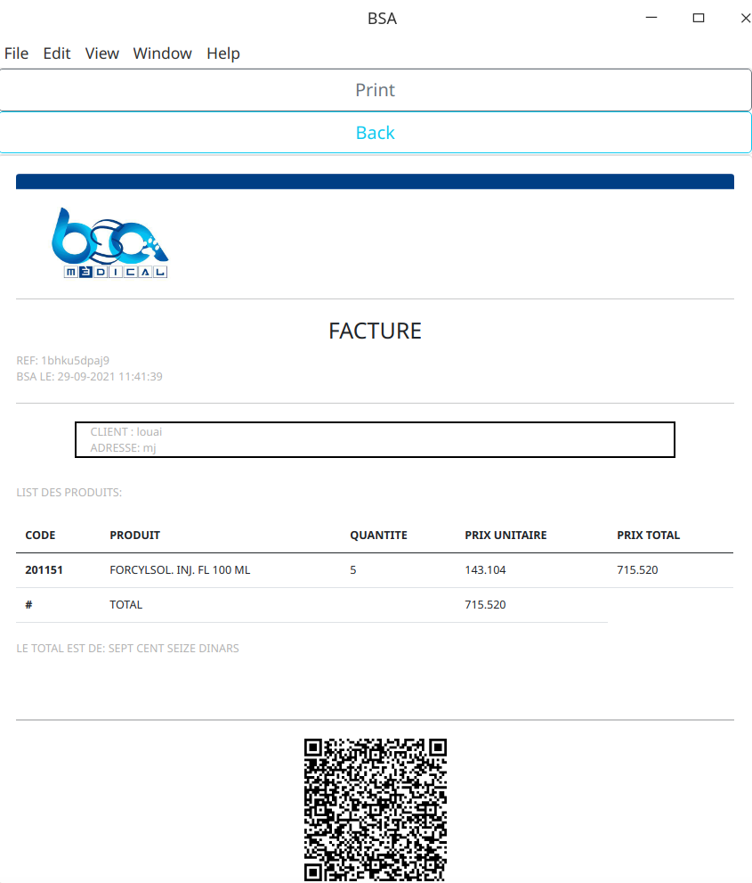

# BSA: Invoice genrator
This desktop application is built using electron JS. Its main functionality is to generate pdf invoices.
Each invoice has a reference number and all the data are stored in a document database ( JSON format).


## Screenshots





## Installation

Clone the repository and follow those steps:

```bash
 npm install
 npm run build
 npm start
```

## Deployment

Use electron-packager dependency to package the application.
Link: https://github.com/electron/electron-packager


## Authors

- [@louazz](https://www.github.com/louazz)
